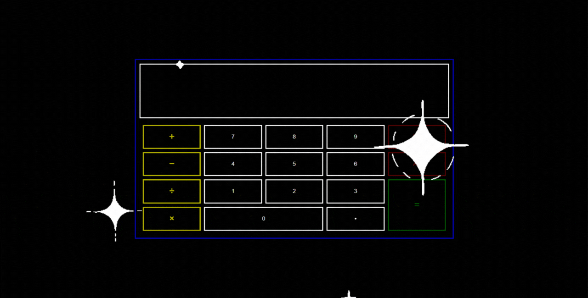
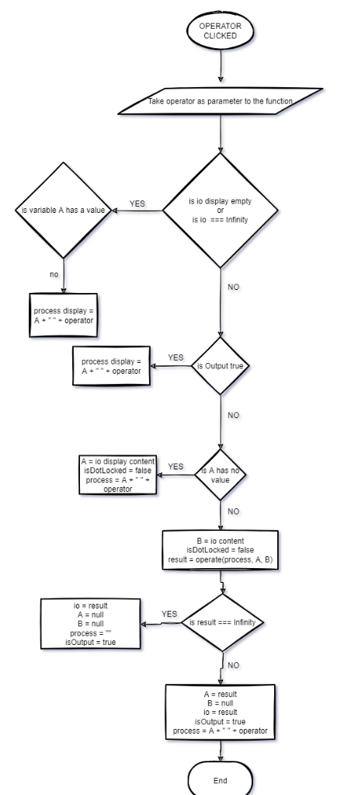
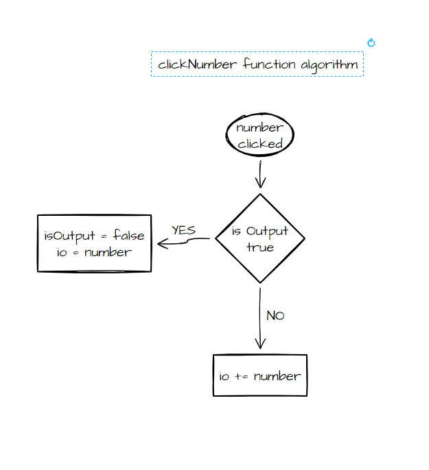
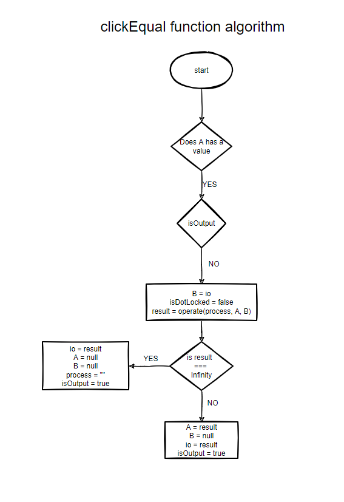
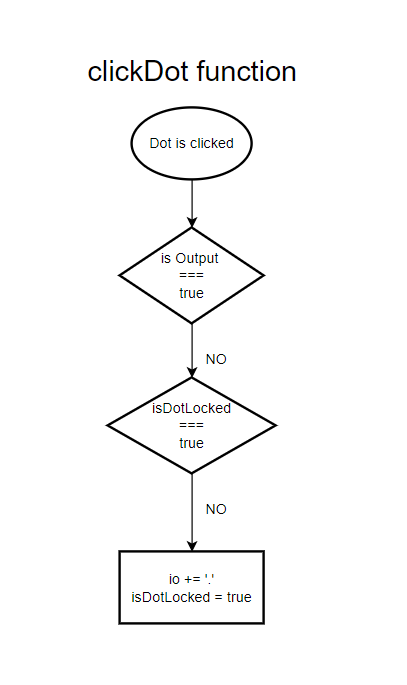

# Calculator

This project was done as part of [The Odin Project](https://www.theodinproject.com/dashboard) foundation course.

# Preview

This project is hosted on Github pages

Take a look :point_right: [Calculator](https://yousef8.github.io/Calculator/)

# Installation

To use this project, first clone the repo on your device using teh command below:

`git init`

`git clone https://github.com/yousef8/Calculator.git`

Then you can open "index.html" file in your browser and start calculating on it.

# Development

In this section I'm gonna share with you the algorithm flowchart of the important functions in my code:

- clickOperator()

  

- clickNumber()

  

- clickEqual()

  

- clickDot()

  

### Adding new features

In the future there will be an update to the UI.
